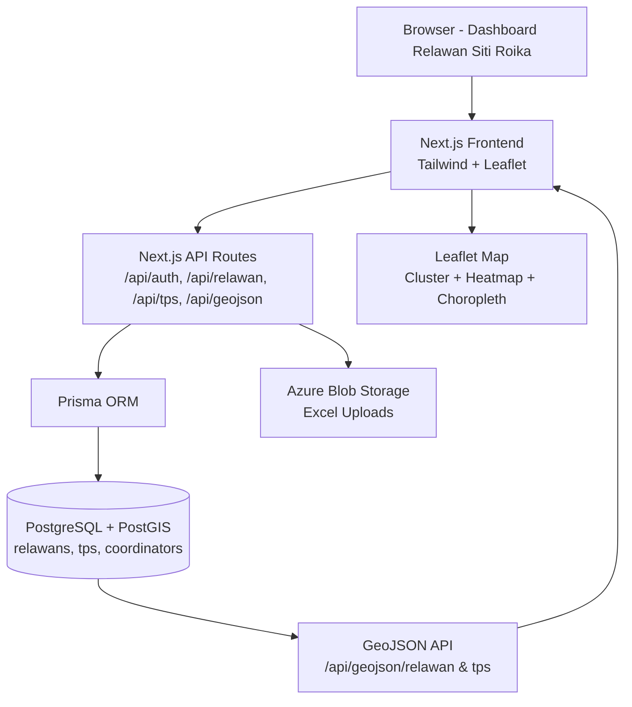
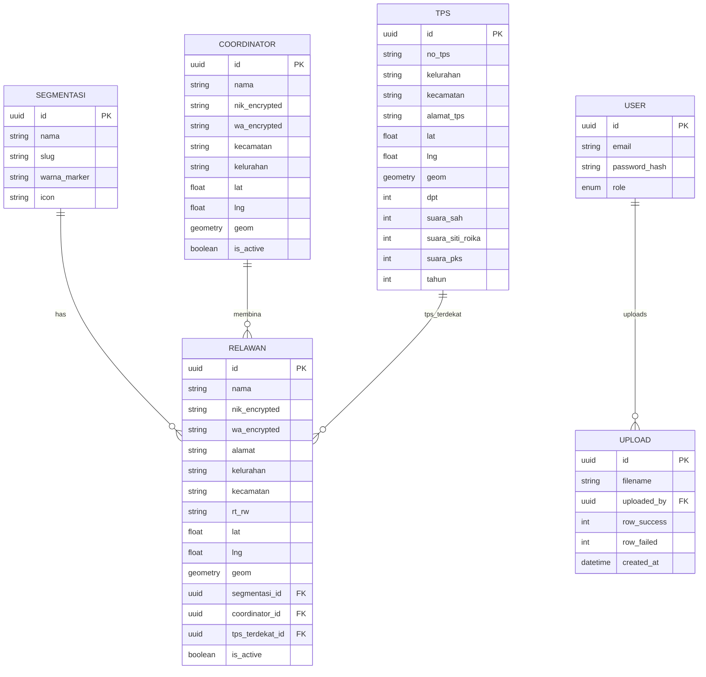

   # ARSITEKTUR SISTEM — Relawan Siti Roika Dapil 1

**Referensi PRD:** `docs/PRD.md`  
**Dapil:** Dapil 1 Kota Semarang — **Semarang Tengah (15 kel) + Semarang Timur (10 kel) + Semarang Utara (9 kel), 7 kursi** — resmi PKPU Dapil 2024 (Siti Roika PKS 3.214 suara terpilih). *Koreksi 07-10-2026.*

**Stack Rekomendasi:** Next.js 14 + PostgreSQL/PostGIS + Prisma + Leaflet

---

### 1. Prinsip Arsitektur

- **Map-First:** Semua entitas punya `lat/lng` + `geom (PostGIS Point 4326)` untuk query radius.
- **Offline-Friendly Import:** Upload Excel/CSV adalah entry point utama (sesuai empty state screenshot).
- **RBAC ketat:** NIK/WA terenkripsi, viewer tidak bisa lihat data sensitif.
- **Murah & Cepat Deploy:** OSM + Leaflet (gratis), tanpa ketergantungan Mapbox berbayar di V1.

### 2. Tech Stack Final

| Layer | Teknologi | Alasan |
| :--- | :--- | :--- |
| Frontend | **Next.js 14 App Router + TypeScript + Tailwind + shadcn/ui** | SEO, SSR peta, DX cepat |
| Peta | **Leaflet 1.9 + react-leaflet + Leaflet.markercluster + Leaflet.heat** | Gratis, ringan, cluster built-in |
| Backend | **Next.js API Routes** (awal) → bisa pecah ke **NestJS** jika tim besar | Satu repo, deploy simple |
| ORM | **Prisma** | Migrasi & typed query aman |
| Database | **PostgreSQL 16 + PostGIS 3.4** | Query `ST_DWithin` untuk blank spot 500m |
| Auth | **NextAuth.js (Auth.js) + bcrypt + JWT** | Role-based, session 24 jam |
| Storage | **Azure Blob Storage** / S3 Compatible | Simpan file upload Excel |
| Hosting | **Azure App Service + Azure Database for PostgreSQL Flexible Server** | Skalabel, backup otomatis |
| Geocoding | **Nominatim OSM** (V1) / Azure Maps (opsional) | Alamat → lat/lng |

> Alternatif low-cost: Supabase (Postgres+PostGIS ready) + Vercel.

### 3. High-Level Architecture



### 4. Component Diagram

```
[UI Layer]
- Dashboard (5 Cards) -> CardKoordinator, CardRelawan, CardTPS, CardSuaraSR, CardPKS
- Tabs: PetaSuaraTab, KoordinatorTab, RelawanTab, DataTPSTab
- MapContainer: BaseOSM + ClusterLayer + HeatmapLayer + ChoroplethLayer
- FilterBar: SegmentasiFilter, KecamatanDropdown, KoordinatorFilter

[API Layer]
- POST /api/auth/login, /api/auth/logout
- GET/POST /api/segmentasi
- GET/POST /api/coordinators, PATCH /api/coordinators/:id
- GET/POST /api/relawans, POST /api/relawans/import, GET /api/relawans/geojson
- GET/POST /api/tps, POST /api/tps/import, GET /api/tps/geojson
- GET /api/stats (untuk 5 cards)
- GET /api/analysis/blank-spot?radius=500
- GET /api/analysis/korelasi-suara-relawan

[Service Layer]
- ImportService (xlsx parsing, validasi, upsert)
- GeoService (ST_DWithin, ST_ClusterDBSCAN, agregasi per kecamatan)
- EncryptionService (AES-256-GCM untuk NIK/WA)
- ExportService (ExcelJS, PDFKit, html2canvas untuk peta PNG)
```

### 5. Data Model (ERD)



### 6. Prisma Schema (inti)

```prisma
datasource db { provider = "postgresql"; url = env("DATABASE_URL") }
generator client { provider = "prisma-client-js" }

model Segmentasi {
  id           String   @id @default(uuid())
  nama         String   @unique
  slug         String   @unique
  warnaMarker  String   @default("#F97316")
  icon         String   @default("users")
  relawans     Relawan[]
}

model Coordinator {
  id        String   @id @default(uuid())
  nama      String
  nikEncrypted String?
  waEncrypted  String
  kecamatan String
  kelurahan String?
  lat       Float?
  lng       Float?
  // geom ditambah via raw SQL: AddGeometryColumn
  isActive  Boolean  @default(true)
  relawans  Relawan[]
  createdAt DateTime @default(now())
}

model Relawan {
  id            String      @id @default(uuid())
  nama          String
  nikEncrypted  String?
  waEncrypted   String
  alamat        String?
  kelurahan     String
  kecamatan     String
  rtRw          String?
  lat           Float
  lng           Float
  segmentasiId  String
  segmentasi    Segmentasi  @relation(fields: [segmentasiId], references: [id])
  coordinatorId String?
  coordinator   Coordinator? @relation(fields: [coordinatorId], references: [id])
  tpsTerdekatId String?
  tpsTerdekat   TPS?        @relation(fields: [tpsTerdekatId], references: [id])
  isActive      Boolean     @default(true)
  createdAt     DateTime    @default(now())
  @@index([kecamatan, kelurahan])
  @@index([segmentasiId])
}

model TPS {
  id              String   @id @default(uuid())
  noTps           String
  kelurahan       String
  kecamatan       String
  alamatTps       String?
  lat             Float
  lng             Float
  dpt             Int
  suaraSah        Int
  suaraSitiRoika  Int      @default(0)
  suaraPKS        Int      @default(0)
  tahun           Int      @default(2024)
  relawans        Relawan[]
  @@unique([noTps, kelurahan, kecamatan])
  @@index([kecamatan])
}
```

**PostGIS Setup (migration SQL):**
```sql
CREATE EXTENSION IF NOT EXISTS postgis;
SELECT AddGeometryColumn('public','relawans','geom',4326,'POINT',2);
SELECT AddGeometryColumn('public','tps','geom',4326,'POINT',2);
UPDATE relawans SET geom = ST_SetSRID(ST_MakePoint(lng, lat),4326) WHERE lat IS NOT NULL;
UPDATE tps SET geom = ST_SetSRID(ST_MakePoint(lng, lat),4326) WHERE lat IS NOT NULL;
CREATE INDEX idx_relawans_geom ON relawans USING GIST(geom);
CREATE INDEX idx_tps_geom ON tps USING GIST(geom);
```

### 7. API Contract (Ringkas)

| Method | Endpoint | Auth | Deskripsi |
| :--- | :--- | :--- | :--- |
| GET | `/api/stats` | Viewer | Return `{koordinator:0, relawan:0, tps:0, suaraSR:0, suaraPKS:0}` |
| GET | `/api/relawans?kecamatan=&segmentasi=&koordinatorId=` | Viewer | List + pagination |
| GET | `/api/relawans/geojson?kecamatan=` | Viewer | FeatureCollection untuk Leaflet |
| POST | `/api/relawans/import` | Admin Dapil | Multipart Excel → validasi → upsert |
| GET | `/api/tps/geojson?mode=sr|pks|total` | Viewer | GeoJSON TPS dengan properti suara |
| POST | `/api/tps/import` | Super Admin | Import TPS massal |
| GET | `/api/analysis/blank-spot?radius=500` | Viewer | List TPS tanpa relawan dalam radius |
| GET | `/api/analysis/korelasi?groupBy=kecamatan` | Viewer | `{kecamatan, totalSuaraSR, totalRelawan, ratio}` |

### 8. Logika 3 Peta Kunci

**Peta Relawan:** `GET /api/relawans/geojson` → Leaflet MarkerCluster. Warna: `segmentasi.warnaMarker`. Popup: nama + WA (masking) + koordinator.

**Peta Komparasi A (Suara SR vs Relawan):**
```sql
SELECT kecamatan,
       SUM(suara_siti_roika) as total_sr,
       (SELECT COUNT(*) FROM relawans r WHERE r.kecamatan = t.kecamatan) as jml_relawan
FROM tps t GROUP BY kecamatan;
```
Render: choropleth kecamatan (gradasi orange by total_sr) + overlay titik relawan.

**Peta Komparasi B (TPS vs Relawan - Blank Spot):**
```sql
SELECT t.* FROM tps t
WHERE NOT EXISTS (
  SELECT 1 FROM relawans r
  WHERE ST_DWithin(t.geom, r.geom, 500) -- 500 meter, geography(true) untuk meter akurat
);
```
Tampil: TPS merah (blank), TPS hijau (ada relawan). Tabel prioritas sort `DPT DESC`.

### 9. Keamanan

- Password bcrypt 12 rounds, JWT httpOnly cookie.
- NIK/WA di-encrypt AES-256-GCM di application layer (bukan DB encrypt).
- RBAC middleware di setiap API route.
- Rate limit login 5x/menit/IP.
- Audit log table `audit_logs(id, user_id, action, entity, entity_id, created_at)`.

### 10. Deployment (Azure)

```
Resource Group: rg-sr-dapil1
- App Service Plan B1 (Linux, Node 20)
  └─ Web App: app-sr-dapil1 (Next.js standalone)
- PostgreSQL Flexible Server B1ms + PostGIS
- Storage Account: stsrblob (container: uploads)
- Application Insights (monitoring)
- Key Vault (DATABASE_URL, ENCRYPTION_KEY)
```

**CI/CD:** GitHub Actions → `azd up` atau `next build` → deploy ke App Service. Migration Prisma via `prisma migrate deploy`.

### 11. Estimasi Biaya Azure (per bulan, V1)
- App Service B1: ~Rp 230rb
- PostgreSQL Flexible B1ms: ~Rp 250rb
- Storage + Bandwidth: ~Rp 50rb
- **Total: ~Rp 500-600rb/bulan** (bisa pakai Free Tier 12 bulan awal)

### 12. Observability
- Application Insights untuk log & error.
- Endpoint `/api/health` untuk uptime check.

---
**Next:** Lihat `RANCANGAN-SISTEM.md` untuk wireframe & alur import, dan `PRD.md` untuk requirement lengkap.
