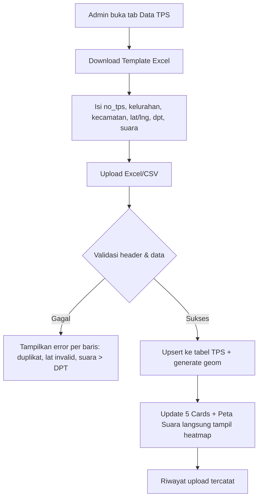

# RANCANGAN SISTEM — Relawan Siti Roika Dapil 1

**Dapil:** Dapil 1 Kota Semarang — **Semarang Tengah + Semarang Timur + Semarang Utara (34 kelurahan, 7 kursi)** — resmi PKPU 2024. *Koreksi 07-10-2026.*

**Dokumen turunan dari:** `PRD.md` & `ARCHITECTURE.md`  
**Fokus:** Wireframe, User Flow, API Spec Detail, Rancangan Peta & Validasi Import

---

### 1. Wireframe — Replika Dashboard Screenshot

**Referensi:** Image 1 — `DAPIL 1 . KOTA SEMARANG / Relawan Siti Roika` (header hitam, 5 cards, tab Peta Suara)

```
┌──────────────────────────────────────────────────────────────────────────────┐
│ HEADER HITAM #1A0F0F                                   [Keluar]             │
│ DAPIL 1 . KOTA SEMARANG (orange #F97316, 12px tracking)                     │
│ Relawan Siti Roika (bold 24px putih)                                         │
├──────────────────────────────────────────────────────────────────────────────┤
│                                                                              │
│  ┌─────────────┐ ┌─────────────┐ ┌─────────────┐ ┌─────────────┐ ┌─────────┐ │
│  │KOORDINATOR  │ │RELAWAN      │ │TPS TERDATA  │ │SUARA SITI   │ │SUARA PKS│ │
│  │0            │ │0            │ │0            │ │0 (orange)   │ │0        │ │
│  └─────────────┘ └─────────────┘ └─────────────┘ └─────────────┘ └─────────┘ │
│                                                                              │
│  Tabs Utama (pill bg #F5F0EB):                                               │
│  [● Peta Suara]  Koordinator  Relawan  Data TPS                              │
│                                                                              │
│  Sub-filter Peta Suara:                                                      │
│  [Suara per TPS] [● Perolehan Siti Roika orange] [Suara PKS per TPS]  [▼ Semua kecamatan] │
│                                                                              │
│  ┌────────────────────────────────────────────────────────────────────────┐  │
│  │                                                                        │  │
│  │   LEAFLET MAP AREA (tinggi 520px, rounded 16px)                        │  │
│  │   ├─ Base: OpenStreetMap                                               │  │
│  │   ├─ Layer: Heatmap / Choropleth (by sub-filter)                       │  │
│  │   ├─ Layer: Cluster Relawan (warna by segmentasi)                      │  │
│  │   └─ Legend + Tooltip                                                  │  │
│  │                                                                        │  │
│  │   EMPTY STATE (jika belum ada data):                                   │  │
│  │   "Belum ada data suara. Unggah file Excel/CSV di tab Data TPS."       │  │
│  └────────────────────────────────────────────────────────────────────────┘  │
└──────────────────────────────────────────────────────────────────────────────┘
```

**Spesifikasi Visual (agar 1:1 dengan screenshot):**
- Background page: `#F9F6F1` (cream). Card: putih `#FFFFFF` border `#E8E0D6`.
- Card active (Suara Siti Roika): bg `#F97316` text putih.
- Pill tabs: bg `#F0E8DD`, active putih shadow. Sub-filter active: bg `#F97316` text putih rounded-full.
- Font: Inter / Plus Jakarta Sans. Radius: 16px (card), 999px (pill).

### 2. Halaman Lengkap (Sitemap)

```
/login                          → Login (email/password)
/                               → Dashboard (Peta Suara) — default
/koordinator                    → Tabel Koordinator + Form Tambah + Mini Peta
/koordinator/:id                → Detail Koordinator + daftar relawan binaan
/relawan                        → Tabel Relawan (filter segmentasi/koordinator/kecamatan)
/relawan/:id                    → Detail Relawan + peta lokasi + riwayat
/relawan/import                 → Upload Excel Relawan
/data-tps                       → Tabel TPS + Upload Excel/CSV + Riwayat Upload
/peta/relawan                   → Fullscreen Peta Relawan (fokus)
/peta/komparasi-a               → Peta Suara SR vs Relawan (overlay + slider)
/peta/komparasi-b               → Peta TPS vs Relawan (blank spot merah/hijau)
/laporan                        → Rekap per kecamatan + Export PDF/Excel
/admin/users                    → Manajemen User & Role (Super Admin)
```

### 3. User Flow Utama

**Flow A — Import Data TPS (sesuai empty state screenshot):**


**Flow B — Tambah Relawan + Otomatis Masuk Peta:**
```
Koordinator/Admin → Form Relawan (nama, WA, alamat, segmentasi, koordinator)
→ Geocode alamat → lat/lng + geom → Simpan
→ Marker baru muncul di Peta Relawan (warna sesuai segmentasi)
→ Hitung ulang blank spot TPS terdekat
```

**Flow C — Analisis Blank Spot:**
```
User buka Peta Komparasi B → Pilih radius 500m → Sistem query ST_DWithin
→ Tampil TPS merah (tanpa relawan), hijau (ada relawan)
→ Tabel prioritas sort DPT DESC → Export Excel untuk rekrutmen
```

### 4. Rancangan Segmentasi (Warna & Icon)

| Segmentasi | Slug | Warna Marker | Icon | Badge |
| :--- | :--- | :--- | :--- | :--- |
| Relawan SR Inti | `sr-inti` | `#F97316` (orange) | star | Orange |
| Majelis Taklim | `majelis-taklim` | `#7C3AED` (ungu) | book | Ungu |
| RT/RW | `rt-rw` | `#0EA5E9` (biru) | home | Biru |
| UMKM | `umkm` | `#10B981` (hijau) | store | Hijau |
| OJOL | `ojol` | `#22C55E` (hijau terang) | bike | Hijau |
| Advokasi | `advokasi` | `#EF4444` (merah) | scale | Merah |
| Remaja/Milenial | `remaja` | `#EC4899` (pink) | users | Pink |
| Lainnya | `lainnya` | `#6B7280` (abu) | dot | Abu |

> Warna dipakai konsisten di: marker peta, badge tabel, legend, chart.

### 5. API Spec Detail (Request/Response)

**GET /api/stats**
```json
// Response 200
{
  "koordinator": 12,
  "relawan": 487,
  "tpsTerdata": 342,
  "suaraSitiRoika": 12450,
  "suaraPKS": 28900
}
```

**GET /api/relawans/geojson?kecamatan=Tembalang&segmentasi=ojol**
```json
{
  "type": "FeatureCollection",
  "features": [
    {
      "type": "Feature",
      "geometry": {"type":"Point","coordinates":[110.443, -7.055]},
      "properties": {"id":"uuid","nama":"Budi","segmentasi":"OJOL","warna":"#22C55E","koordinator":"Siti A","kelurahan":"Bulusan"}
    }
  ]
}
```

**POST /api/tps/import** (multipart/form-data, field `file`)
- Validasi: header wajib, lat/lng numeric, `suara_siti_roika <= suara_sah`.
- Response:
```json
{"success": 340, "failed": 2, "errors":[{"row":45,"msg":"no_tps duplikat di Bulusan"}]}
```

**GET /api/analysis/blank-spot?radius=500**
```json
{
  "radius": 500,
  "totalTPS": 342,
  "tpsTanpaRelawan": 87,
  "list": [
    {"no_tps":"08","kelurahan":"Kramas","kecamatan":"Tembalang","dpt":298,"lat":-7.06,"lng":110.44,"jarakTerdekat": 820}
  ]
}
```

**GET /api/analysis/korelasi?groupBy=kecamatan**
```json
[
  {"kecamatan":"Tembalang","totalSuaraSR":4200,"totalRelawan":45,"ratio":0.0107,"status":"kurang relawan"},
  {"kecamatan":"Banyumanik","totalSuaraSR":3800,"totalRelawan":112,"ratio":0.029,"status":"ideal"}
]
```

### 6. Validasi Import (Aturan Keras) — Dapil 1 Resmi

| Field | Aturan | Error Jika |
| :--- | :--- | :--- |
| `no_tps` | String 2 digit, unik per kelurahan | Duplikat → reject baris |
| `kelurahan/kecamatan` | Wajib: kelurahan harus 34 kelurahan Dapil 1 (Semarang Tengah 15 + Timur 10 + Utara 9), kecamatan salah satu dari 3 itu | Tidak dikenal → warning |
| `lat` | -11 s/d 6 | Di luar → reject |
| `lng` | 95 s/d 141 | Di luar → reject |
| `dpt` | int >0 | <=0 → reject |
| `suara_sah` | int <= dpt | > dpt → reject |
| `suara_siti_roika` | int <= suara_sah | > suara_sah → reject |
| `suara_pks` | int <= suara_sah | > suara_sah → reject |

> Template contoh sudah pakai Pekunden (Tengah), Kemijen (Timur), Bandarharjo (Utara) — lihat `templates/template_data_tps.csv`.

Semua error dikumpulkan, tidak stop di baris pertama. File > 5000 baris tetap diproses chunk.

### 7. Rancangan Peta — Detail Teknik

**Library:** `leaflet@1.9`, `react-leaflet@4`, `leaflet.markercluster`, `leaflet.heat`

**Performa:**
- TPS & Relawan > 1000 → gunakan `MarkerCluster` + `preferCanvas:true`.
- Heatmap untuk mode `Perolehan Siti Roika` → intensity = `suara_siti_roika / DPT`.
- Choropleth kecamatan → GeoJSON batas kecamatan (dari BPS/BIG) di-merge dengan agregasi suara.

**Interaksi:**
- Filter dropdown `Semua kecamatan` → refetch GeoJSON + re-render layer (tanpa reload page).
- Slider opacity (0-100%) di Peta Komparasi A untuk lihat overlap.
- Klik marker → popup + tombol `Lihat Detail`.

### 8. Keamanan & Privasi

- NIK/WA encrypt AES-256-GCM dengan `ENCRYPTION_KEY` di Key Vault. Decrypt hanya di server, tidak pernah kirim NIK full ke client (hanya `****1234`).
- Middleware `withAuth(role)` di setiap API.
- Audit: setiap POST/PATCH/DELETE tulis ke `audit_logs`.

### 9. Testing & UAT Checklist

- [ ] Upload template 342 TPS Dapil 1 → 5 cards update, peta heatmap tampil.
- [ ] Tambah 10 relawan OJOL di Tembalang → cluster hijau muncul, filter OJOL hanya hijau.
- [ ] Peta Komparasi B: buat 1 TPS tanpa relawan 500m → marker merah muncul + masuk tabel blank spot.
- [ ] Role Viewer login → tidak ada tombol Hapus/Edit.
- [ ] Export PDF laporan → file terdownload dengan kop `Relawan Siti Roika - Dapil 1`.

### 10. Template File

- `templates/template_data_tps.xlsx` — header + 2 contoh baris + validasi dropdown kecamatan.
- `templates/template_relawan.xlsx` — header: `nama, nik, wa, alamat, kelurahan, kecamatan, rt_rw, lat, lng, segmentasi, koordinator_nama`.

---
**Implementasi Next:** Jalankan `npx create-next-app` + `prisma init` + copy schema dari `ARCHITECTURE.md` → `npx prisma migrate dev` → implementasi `app/(dashboard)/page.tsx` replika screenshot.
